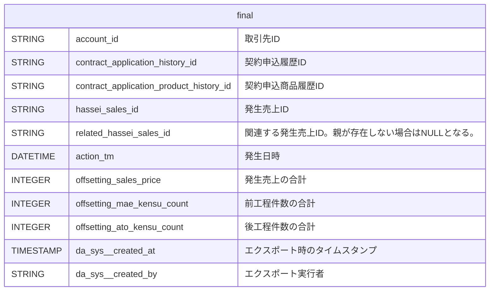

  
開発者向け詳細設計

```mermaid
erDiagram
  final {
    STRING account_id  "取引先ID"
    STRING contract_application_history_id  "契約申込履歴ID"
    STRING contract_application_product_history_id  "契約申込商品履歴ID"
    STRING hassei_sales_id  "発生売上ID"
    STRING related_hassei_sales_id  "関連する発生売上ID。親が存在しない場合はNULLとなる。"
    DATETIME action_tm  "発生日時"
    INTEGER offsetting_sales_price  "発生売上の合計"
    INTEGER offsetting_mae_kensu_count  "前工程件数の合計"
    INTEGER offsetting_ato_kensu_count  "後工程件数の合計"
    TIMESTAMP da_sys__created_at  "エクスポート時のタイムスタンプ"
    STRING da_sys__created_by  "エクスポート実行者"
  }
```

> [!WARNING]
> 今回は発生日を更新する対応は要件外だったので対応していない。
> 一般的な相殺処理では、処理を適用した日時で発生日を更新することが多い。
> 発生日が変化してしまう影響は未知なので、今後の検討材料になる可能性はある点は留意する必要がある。

:::note warn
警告
○○に注意してください。
:::

