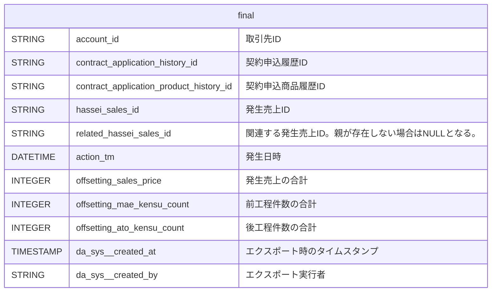

#### 1. ある発生売上IDに対し、関連する発生売上IDのレコードを突合し、売上金額、前工程件数、後工程件数を足し合わせる。

<details>
  <summary>開発者向け詳細設計</summary>



```
⚠️注意
今回は発生日を更新する対応は要件外だったので対応していない。
一般的な相殺処理では、処理を適用した日時で発生日を更新することが多い。
発生日が変化してしまう影響は未知なので、今後の検討材料になる可能性はある点は留意する必要がある。
```

:::note warn
警告
○○に注意してください。
:::

> [!WARNING]
> Critical content demanding immediate user attention due to potential risks.

| 発生売上ID | 関連発生売上ID | 発生日 | 前工程件数 | 発生売上 |
| :--- | :--- | :--- | ---: | ---: |
| $`\textcolor{red}{\text{a1610000009XdYHAA0}}`$ | | 2014-03-20 | 1 | 50000 |
| $`\color{red}{a1610000009XdYHAA0}`$ | | 2014-03-20 | 1 | 50000 |
| a1610000009XobfAAC | <span style="color: red">a1610000009XdYHAA0</span> | 2014-03-27 | -1 | -50000 |


[2. 上記対応後、前工程件数、発生売上の状態によって抽出する。](/til/docs/alert_test.md#2.+%E4%B8%8A%E8%A8%98%E5%AF%BE%E5%BF%9C%E5%BE%8C%E3%80%81%E5%89%8D%E5%B7%A5%E7%A8%8B%E4%BB%B6%E6%95%B0%E3%80%81%E7%99%BA%E7%94%9F%E5%A3%B2%E4%B8%8A%E3%81%AE%E7%8A%B6%E6%85%8B%E3%81%AB%E3%82%88%E3%81%A3%E3%81%A6%E6%8A%BD%E5%87%BA%E3%81%99%E3%82%8B%E3%80%82)参照。
</details>


#### 2. 上記対応後、前工程件数、発生売上の状態によって抽出する。

aaa
