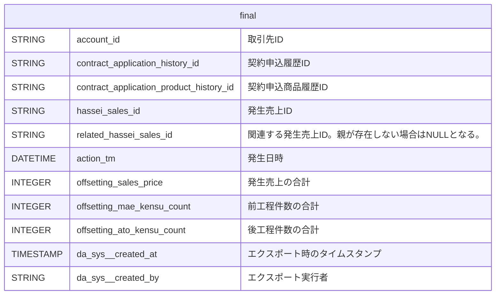

#### 1. ある発生売上IDに対し、関連する発生売上IDのレコードを突合し、売上金額、前工程件数、後工程件数を足し合わせる。

<details>
  <summary>開発者向け詳細設計</summary>



```
⚠️注意
今回は発生日を更新する対応は要件外だったので対応していない。
一般的な相殺処理では、処理を適用した日時で発生日を更新することが多い。
発生日が変化してしまう影響は未知なので、今後の検討材料になる可能性はある点は留意する必要がある。
```

:::note warn
警告
○○に注意してください。
:::

> [!WARNING]
> Critical content demanding immediate user attention due to potential risks.

| 発生売上ID | 関連発生売上ID | 発生日 | 前工程件数 | 発生売上 |
| :--- | :--- | :--- | ---: | ---: |
| $`\textcolor{red}{\text{a1610000009XdYHAA0}}`$ | | 2014-03-20 | 1 | 50000 |
| $`\color{red}{a1610000009XdYHAA0}`$ | | 2014-03-20 | 1 | 50000 |
| a1610000009XobfAAC | <span style="color: red">a1610000009XdYHAA0</span> | 2014-03-27 | -1 | -50000 |


[2. 上記対応後、前工程件数、発生売上の状態によって抽出する。](/docs/alert_test.md#2-上記対応後前工程件数発生売上の状態によって抽出する)参照。
</details>

古池や蛙飛びこむ水の音  
閑さや岩にしみ入る蝉の声  
五月雨をあつめて早し最上川  
夏草や兵どもが夢の跡  
旅に病んで夢は枯野をかけ廻る  
秋深き隣は何をする人ぞ  
物いえば唇寒し秋の風  
春の海終日のたりのたりかな  
菜の花や月は東に日は西に  
ゆく春やおもたき琵琶の抱心  
荒海や佐渡に横たふ天の河  
梅が香にのっと日の出る山路かな  
山路きて何やらゆかしすみれ草  
さみだれや大河を前に家二軒  
夏河を越すうれしさよ手に草履  
みじか夜や毛虫の上に露の玉  
目には青葉山ほととぎす初鰹  
鎌倉をいきて出でけむ初鰹  
大江戸や犬もありつく初鰹  
水桶にうなづきあふや瓜茄子  
飯食ふて遊ぶや瓜のかみどころ  
五月雨や色紙へ書けぬ物語  
初蝶のやがてなきぬる野辺の空  
木の間より見ゆる海の夕月夜  
行く秋の我にかかわる事もなく  
白き帆を追うてゆくや夏の海  
稲妻の闇を走るや秋の夜  
草の葉を吹きゆく風の香もよし  
白魚のほろほろと散るや花の春  
うぐひすや竹の葉づたひ山路かな  
春風や堤長うして日暮れけり  
水枕のうたがたを離れて眠りけり  
朝顔に釣瓶とられてもらひ水  
初雪や水仙の葉の上の霜  
白梅のあとよりさくら遅咲きの  
春の夜の夢はうつつかまぼろしか  
夏の夜はまだよひながら明けにけり  
夕焼や雀とんびに追ひ立てられ  
いざいざと子供呼ぶ声さくらかな  
紅梅や枝に雪散る軒の端  
雪まじり梅に紅さすたそがれ時  
春雨や軒に垂りたる蜘蛛の糸  
夏の月を仰ぎてはただ恋しけり  
朝顔や一夜のうちに千々の色  
秋風や野に咲く花の乱れ咲き  
冬の月や水に映りて影もなし  
鶯や竹の葉かげに身をかくし  
春の夜や花に遊びて夢も見ず  
秋の月を眺めてはただひとりかな  
冬の朝や窓に結びて雪の結晶  


#### 2. 上記対応後、前工程件数、発生売上の状態によって抽出する。

aaa
