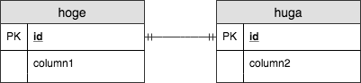

# [sample.sql](../sql/sample.sql)

## Difinition

|column|name|datatype|size|nn|
|---|---|---|---|---|
|column1|name1|char|10|true|
|column2|name2|numeric|5, 0|true|

## Entity Relation Diagram

### PNG

### Sequence Dialog

### Mermaid

